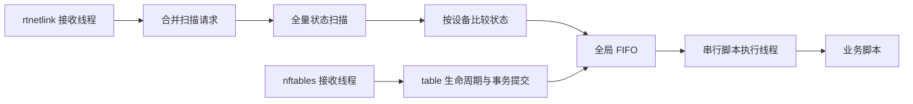

# 结构与事件生命周期

## 模块职责

| 模块 | 职责 |
| --- | --- |
| `options`、`config` | 启动参数、配置读取、实际设备范围 |
| `netlink/transport` | socket、poll、datagram 接收、丢失识别 |
| `netlink/query` | 请求与 sequence、单次查询、完整 dump |
| `netlink/filter` | socket BPF 生成和 ifindex 更新 |
| `netlink/codec` | link、address、route 消息与属性解码 |
| `netlink::Reader` | 读取并规范化接口、地址和路由快照 |
| `source` | rtnetlink 接收线程、合并扫描请求 |
| `model`、`event` | 状态模型、差异比较、当前状态事件 |
| `nftables` | 全命名空间 table 基线、事务跟踪、reload 判定 |
| `scheduler` | 设备状态缓存、全局 FIFO、待处理状态合并 |
| `runner` | 脚本排序、环境变量与 JSON、超时和进程组回收 |
| `logging`、`main` | JSON 行日志、启动、扫描与进程信号 |

事件源通过领域状态或已确认的动作提交任务，脚本执行层接收 `ScriptEvent`。rtnetlink 和 nftables 共用查询与 socket 实现。

## 接收与扫描

启动时读取配置，订阅通知，再建立状态基线。rtnetlink 监听 link、IPv4/IPv6 address 与 route；nftables 监听整个网络命名空间。设备白名单为空时仅运行 nftables 事件源。

rtnetlink 监听 socket 通过 `SO_ATTACH_FILTER` 安装 BPF：link 按 `IFLA_IFNAME` 或已知 ifindex 匹配，地址按 ifindex 匹配，路由按 `RTA_OIF`、`RTA_IIF` 和 `RTA_MULTIPATH` 匹配。过滤发生在通知进入内核接收队列之前。相关 link 通知或通知丢失后重新读取设备索引，替换过滤器，再发布扫描请求。新设备通过名字匹配进入监听；索引更新期间的变化由 link 通知触发的扫描核对。

BPF 保留错误与 overrun 通知。含多条消息的 datagram 整体保留；多路径路由检查前 32 个 next hop，超过该范围的对象整体保留。状态比较仅投影配置设备的地址与关联路由。路由归属依据输出、输入接口或 multipath next hop。过滤器安装失败在启动时报错。

查询 socket 与监听 socket 分开使用。通知合并为扫描请求，扫描期间的新通知留在接收线程的 mailbox 中，下一轮继续处理。每轮接收最多 256 个 datagram，随后发布请求并检查停止标志。

每个 socket 请求 4 MiB 接收缓冲区。具备 `CAP_NET_ADMIN` 时使用 `SO_RCVBUFFORCE`，权限不足时使用 `SO_RCVBUF`；日志记录实际容量。接收复用固定 datagram 缓冲区。socket BPF 和缓冲区行为见 [Linux Socket Filtering](https://www.kernel.org/doc/html/latest/networking/filter.html)、[Linux af_netlink.c](https://github.com/torvalds/linux/blob/master/net/netlink/af_netlink.c) 与 [socket(7)](https://man7.org/linux/man-pages/man7/socket.7.html)。

## 状态与调度

快照规范化地址与路由顺序。比较使用地址、前缀和路由属性集合；地址 lifetime 与路由 expires 分别处理。路由协议来自 `rtm_protocol`，`RTA_TABLE` 优先于 `rtm_table`；PPP 本地地址来自 `IFA_LOCAL`，peer 来自 `IFA_ADDRESS`。变化标志的定义见 [脚本事件格式](events.md)。

调度器为每个配置设备保存最近观测状态、上次分发状态、首次恢复任务和一个最新待处理任务。首次恢复任务保持启动扫描的状态与零变化标志。运行期间的观测单独排队；新出现的设备从已知不存在状态比较。

所有事件源共用一个脚本执行线程，任务按 FIFO 排队。一个任务中的脚本执行完成后处理下一个任务。正在执行或排队的设备发生后续变化时，更新其待处理状态；完成当前调用后将后续任务加入队尾。每个设备在队列中最多占一个位置，状态缓存规模由设备配置限定。慢脚本期间的连续更新合并为最新状态，`coalesced_updates` 记录合并次数。

变化标志根据上次分发状态与本次当前状态计算。排队期间出现 A → B → A 时，最终地址集合与上次分发相同，地址变化标志为零，原因记录为 `coalesced`。重复通知在观测比较阶段合并，实际状态差异在分发阶段再次计算。

nftables 为已确认的 reload 保存计数，每次确认对应一次目录调用。合并后保留最近的 table 元数据，generation 为 `null`。每次执行一个 reload 后返回队尾，使其他任务继续处理。比较基线在分发时推进，脚本失败记录结果后继续执行独立脚本和后续任务。

## 恢复与执行

`ENOBUFS`、`NLMSG_OVERRUN` 或 datagram 截断触发重新扫描。rtnetlink 保留已知状态，用正常接口动作分发，原因为 `netlink_loss`。当前状态相同时恢复调用的地址与 PD 标志为零。

不完整 dump 丢弃整份快照，保留比较基线，记录 `snapshot_incomplete`，等待 100 ms 后再次扫描。其他查询或接收错误由主进程记录并退出，systemd 按 `Restart=on-failure` 恢复。`SIGHUP` 核对当前状态，原因为 `manual`。

脚本使用固定 `/bin/sh` 和独立路径参数启动，目录内普通文件按名字节序排序。每个脚本通过环境变量、事件文件和 stdin 获取同一事件。子进程环境由固定 `PATH`、`LANG=C` 和事件变量组成。

退出码 `0` 表示成功，非零退出、启动失败、目录读取失败和超时分别记录。独立目录与脚本继续执行。单个脚本超时为 30 秒；超时向进程组发送 `SIGTERM`，等待最多 1 秒后发送 `SIGKILL`，并回收主进程。正常结束后也回收同一进程组中的后台子进程。`SIGTERM`、`SIGINT` 停止任务并终止当前脚本。

日志为 JSON 行，记录时间、级别、事件、设备、目录、脚本、退出码、耗时及终止原因。事件文件在本次目录调用期间有效，结束后删除。

## nftables reload

监听 socket 先订阅 `NFNLGRP_NFTABLES`。基线查询依次读取 generation、全部 family 的 table、generation；两次 generation 一致且 dump 完整时接受基线。扫描期间的通知保留在监听 socket 中。

table 新增、删除通知按顺序保留，等待 `NFT_MSG_NEWGEN` 后处理。当前 table 集合由非空变为空，表示整个规则集清空；随后创建 table，且重建事务提交时规则集非空，确认一次 reload。原子清空与重建在同一事务确认；分步加载在清空事务提交后继续等待重建。删除并重建最后一个 table 具有相同的可观察生命周期。

普通 rule、set/map elements 更新只推进提交边界；table 属性更新维护当前 table 集合。reload 的依据是完整清空和重建的生命周期，`NFT_MSG_NEWGEN` 确认事务提交。

启动和丢失恢复从已提交 generation 建立基线，跳过已包含在基线中的排队事务。generation 缺口、socket 丢失、overrun、截断、table 通知拥塞或状态不一致会记录原因，清除待确认清空状态并重新扫描。新基线用于跟踪后续完整生命周期。

提交行为见 [Linux nf_tables_api.c](https://github.com/torvalds/linux/blob/master/net/netfilter/nf_tables_api.c)，netlink 丢失同步见 [netlink(7)](https://man7.org/linux/man-pages/man7/netlink.7.html)。串行 hotplug 排队参考 [OpenWrt netifd interface-event.c](https://github.com/openwrt/netifd/blob/master/interface-event.c)。
